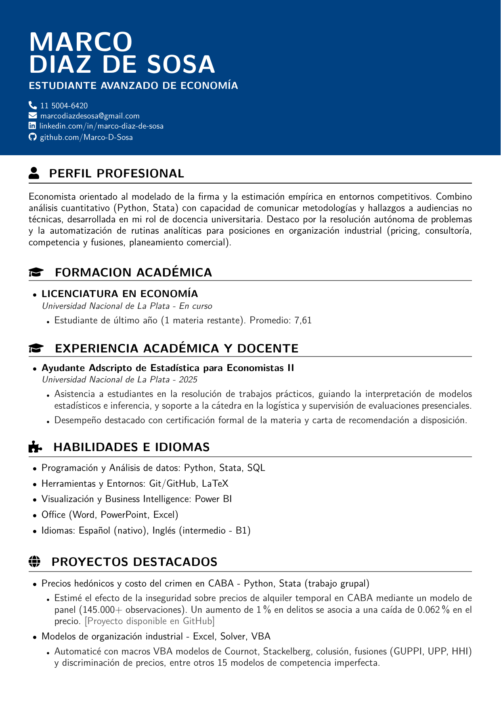

<p align="center">
  
</p>

<p align="center">
  <a href="CV_Marco_Diaz_de_Sosa.pdf">📄 Descargar CV (Español)</a> ·
  <a href="CV_Marco_Diaz_de_Sosa_English.pdf">📄 Download CV (English)</a>
</p>

# CV — Diaz de Sosa, Marco

LaTeX source code for my curriculum vitae.

## Structure

├── .gitignore

├── README.md

├── CV_Marco_Diaz_de_Sosa.tex # Main document

├── CV_Marco_Diaz_de_Sosa_English.tex

├── CV_Marco_Diaz_de_Sosa.pdf # Compiled version (ES)

├── CV_Marco_Diaz_de_Sosa_English.pdf # Compiled version (EN)

└── cv-preview-es.png # README preview image

## Design

This document does not use a pre-built class or template (moderncv, awesome-cv, etc.); the layout was built from scratch in LaTeX, replicating and adapting a reference CV design.

## Requirements

- LaTeX distribution (TeX Live 2025 or compatible)
- Compiler: pdfLaTeX

## How to compile

### Option 1: Overleaf (recommended)

1. Upload this repository as a new Overleaf project, or connect it directly via GitHub (Menu → GitHub → Import from GitHub).
2. Make sure the main document is set to `cv.tex` or `cv_english.tex` (Menu → Settings → Main document).
3. Verify the compiler is set to `pdfLaTeX`.
4. Compile using the "Recompile" button.

### Option 2: Local

```bash
pdflatex cv.tex
```
May need to run twice if the document includes cross-references or a table of contents.

## License

Personal use. The code may be used as a reference, but the content (personal data, experience) is specific to my profile.
